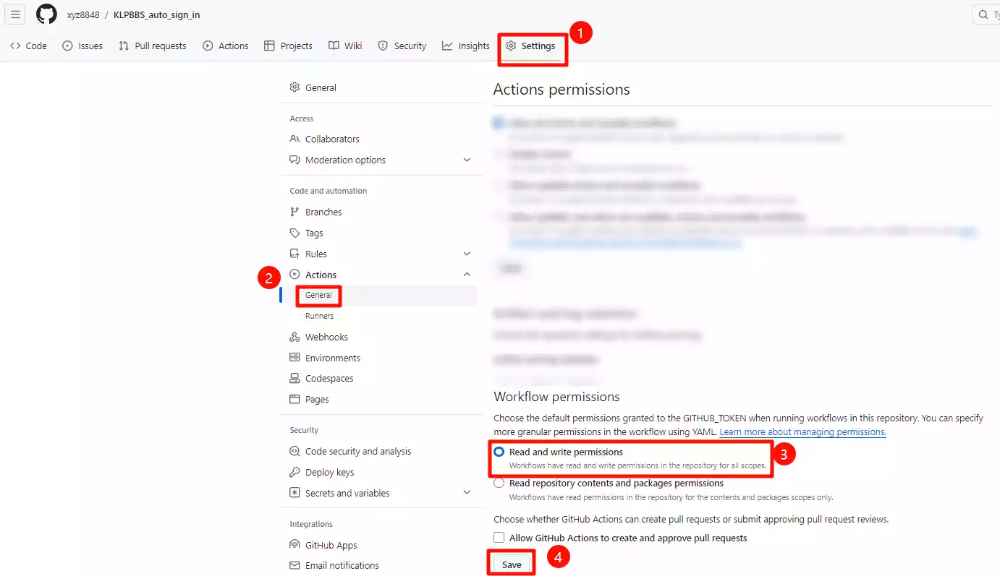
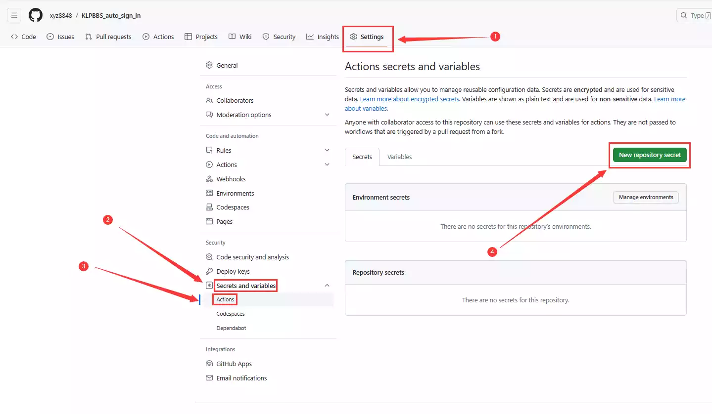

## 基于 GitHub Action 的苦力怕论坛自动签到脚本

根据xyz8848的gitee库修改了部分提示词，逻辑部分没问题，目前还可以使用。

## 如何使用

1. Fork 这个仓库
2. 授予工作流读取和写入权限（用于工作流保活，如果仓库中在过去 60 天内没有提交，GitHub 将暂停 GitHub 工作流的计划触发器。除非进行新的提交，否则基于 cron 的触发器不会运行。）

3. 打开 Actions secrets and variables  

4. 添加以下 secret：[`USERNAME`](https://github.com/xyz8848/KLPBBS_auto_sign_in/blob/main/docs/secrets.md#username)，[`PASSWORD`](https://github.com/xyz8848/KLPBBS_auto_sign_in/blob/main/docs/secrets.md#password)

## 自定义签到时间
（默认每天 6:30 签到，可能略有延迟是正常的）
1. 到 [`.github/workflows/sign_in.yml`](.github/workflows/sign_in.yml) 中修改签到时间

## 签到后Server酱提示
1. 打开 Actions secrets and variables
2. 添加以下 secret：[`SERVERCHAN_ENABLE`](https://github.com/xyz8848/KLPBBS_auto_sign_in/blob/main/docs/secrets.md#serverchan_enable)，[`SERVERCHAN_KEY`](https://github.com/xyz8848/KLPBBS_auto_sign_in/blob/main/docs/secrets.md#serverchan_key)
   tip. ENABLE的值输入1就可以了，不是true
